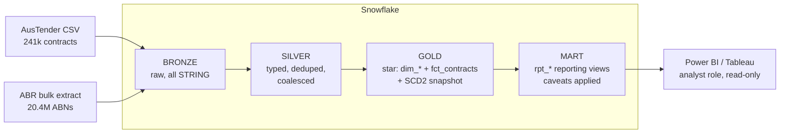

# AusTender Data Platform — Snowflake · dbt · Medallion · RBAC

[](https://github.com/DimaKarma/austender-data-platform/actions/workflows/dbt_ci.yml)
[](https://dimakarma.github.io/austender-data-platform/)

📖 **[Browsable dbt docs — model catalog, column descriptions, and lineage graph](https://dimakarma.github.io/austender-data-platform/)** (published to GitHub Pages by the Deploy workflow).

An end-to-end analytics pipeline built on real data about Australian federal
contracts ([AusTender](https://www.tenders.gov.au/)). The project targets the
stack and requirements of the Medavie data-engineering role: **Snowflake, dbt,
Medallion Architecture, RBAC, CI/CD**.

> **TL;DR** — 241,164 government contracts flow through a Bronze → Silver → Gold →
> Mart pipeline in Snowflake. Along the way it corrects a **$11.2B**
> double-counting of contract amendments, loads the **20.4M-ABN** business register
> as a second source to tell a real supplier from an agency's own ABN used as a
> placeholder, and serves BI through a consumption layer where analysts *cannot*
> run the naive (wrong) query — the raw star is hidden by grants. dbt does the
> transforms, with an incremental fact, an SCD2 snapshot, and custom tests that
> guard real regressions. **Every number in this README is verified against the
> live account.** The most honest part is the commit history: an attempt to key
> the supplier dimension on ABN, its revert, and the register-based fix that
> replaced it — see *Data quality notes*.

## What this project demonstrates

- **Reference-data enrichment** — the Australian Business Register loaded as a
  second Bronze source (~20.4M ABNs) to check the contracts' supplier ABNs
  against the authority that issues them.
- **Snowflake** — warehouse, database, schemas, file format, internal stage, `COPY INTO`.
- **RBAC** — functional roles (`de` / `analyst` / `ci`), a hierarchy under `SYSADMIN`,
  and least privilege: the analyst sees only the Mart, and the CI role is granted
  nothing on the prod star (it can read Bronze and build its own `CI_*` schemas).
- **Medallion Architecture** — **Bronze** (raw) → **Silver** (cleansed) → **Gold**
  (star schema) → **Mart** (reporting views).
- **SCD2 history** — a dbt snapshot tracks the supplier dimension's
  register-sourced attributes over time (an ABN going `ACT` → `CAN`), so a rename
  or a cancellation is preserved instead of overwritten on rebuild.
- **dbt Core** — sources + freshness, staging/silver/gold models, surrogate keys,
  an **incremental** fact table, tests (`unique`, `not_null`, `relationships`), macros, `dbt_utils`.
- **Delta ingestion, end to end** — the loader MERGEs on the notice key and
  refreshes `_loaded_at` only for rows that actually changed, so the incremental
  fact merges just the delta (0 rows when nothing changed) instead of the whole
  table every run. Three modes: `incremental` reads Bronze's high watermark (max
  `publishdate`) and uploads only newer rows — 207 instead of 241k on the current
  data — mirroring how you'd page a real API; `delta` (default) MERGEs the full
  snapshot to also catch corrections and source-side deletes; `full` is a
  TRUNCATE+INSERT reset.
- **CI/CD** — GitHub Actions. **CI**: `dbt build` (run + test) on every PR, into
  isolated `CI_*` schemas so a PR run never rebuilds the SILVER/GOLD/MART that BI
  reads. **CD**: a manual, gated `workflow_dispatch` **Deploy** button rebuilds the
  prod schemas — the button is the promotion gate, so there is no unreviewed
  auto-deploy to the shared trial account. The two run as **separate** key-pair
  service users: CI's is least-privilege (bronze-read only, cannot touch prod);
  deploy's has prod write. No human password reaches GitHub.
- **ELT automation** — a Python loader instead of importing the CSV by hand.

## Architecture



<details>
<summary>Same picture as ASCII (for terminals)</summary>

```
                 ┌────────────────────────────────────────────────────────┐
 CSV (AusTender) │                     SNOWFLAKE                           │
       │         │                                                        │
       ▼         │   BRONZE                SILVER              GOLD        │
 load_to_bronze  │   raw_contract_data ─▶  stg_contracts ─▶   dim_supplier │
   (PUT + COPY)  │   (all STRING)          slv_contracts      dim_agency   │
                 │                         (types, dedup,     dim_category │
                 │                          COALESCE)         dim_date     │
                 │                                            fct_contracts│──▶ Power BI
                 └────────────────────────────────────────────────────────┘
        Python loader              dbt (staging→silver)     dbt (gold star schema)
```
</details>

CI builds the same models under `CI_SILVER`/`CI_GOLD`/`CI_MART` (the
`generate_schema_name` macro prefixes `CI_` on the `ci` target), reading the
shared BRONZE sources but writing throwaway copies, so a PR run in progress cannot
hand an analyst a half-built table.

The Gold model is a **star**: the `fct_contracts` fact (grain = one contract)
plus the `dim_supplier`, `dim_agency`, `dim_category` and `dim_date` dimensions,
joined through surrogate keys.

## Repository layout

```
Med-Pet/
├── bootstrap.py                     # from zero: infra → RBAC → bronze → dbt build
├── snowflake/
│   ├── 01_setup_infra_rbac.sql      # warehouse, db, schemas, roles, RBAC grants
│   └── 02_bronze_table_stage.sql    # bronze table, file format, stage
├── ingestion/
│   ├── load_to_bronze.py            # ELT: local CSV → PUT → COPY INTO bronze
│   ├── load_abr_to_bronze.py        # ABR reference data: download → stream XML → bronze
│   └── .env.example                 # credentials template (the real .env is not committed)
├── austender_project/               # dbt project
│   ├── dbt_project.yml
│   ├── packages.yml                 # dbt_utils
│   ├── profiles.example.yml
│   ├── macros/                      # generate_schema_name, clean_string,
│   │                                #   contract_amendment (-A<n> parsing)
│   ├── tests/                       # assert_gold_matches_silver (drift guard)
│   ├── seeds/                       # known_non_suppliers (curated: FMS, panels)
│   ├── snapshots/                   # supplier_history (SCD2)
│   └── models/
│       ├── staging/                 # stg_contracts, stg_abr_entity, stg_abr_names
│       ├── silver/                  # slv_contracts (+ tests)
│       ├── gold/                    # dim_* , fct_contracts (+ tests)
│       └── mart/                    # rpt_* reporting views (consumption layer)
├── .github/workflows/dbt_ci.yml     # CI: dbt build on PR
├── requirements.txt
└── .gitignore
```

## Getting started

### 0. Data
`AustralianFederalContracts.csv` (15 columns: `agencyname, value, suppliername,
description, publishdate, contractstart, contractend, procurementmethod, category,
agencyabn, supplierabn, categoryunspsc, cnid, supplierid, sourceurl`) sits in the
repo root. `cnid` is the natural key of a contract.

### 1. One command: `bootstrap.py`

```bash
pip install -r requirements.txt
cp ingestion/.env.example ingestion/.env    # fill in ACCOUNT + USER from the trial
python bootstrap.py
```

A single script stands the project up from scratch on a fresh trial: infra + RBAC
(substituting your username for `YOUR_USERNAME`), the bronze table and stage,
`profiles.yml` generation, the CSV load, and `dbt build`. It is idempotent — a
re-run is safe. If the credentials in `.env` are blank, the script stops and tells
you what is missing.

Flags: `--only-sql` (infrastructure only), `--skip-load`, `--skip-dbt`, `--file <path>`.

The Snowflake account itself is created by hand at
https://signup.snowflake.com (edition **Enterprise**); the signup is behind a
CAPTCHA and email confirmation, so it cannot be automated. The Account Identifier
comes from Snowsight → Admin → Accounts → copy button.

### 2. Manual path (when you want step-by-step control)

<details>
<summary>Expand</summary>

```sql
-- Worksheet, as ACCOUNTADMIN; replace YOUR_USERNAME (SELECT CURRENT_USER();)
snowflake/01_setup_infra_rbac.sql
-- as austender_de
snowflake/02_bronze_table_stage.sql
```
```bash
cd ingestion && python load_to_bronze.py --file ../AustralianFederalContracts.csv
# Default mode=delta: re-running MERGEs the snapshot, touching only changed rows.
#   --mode incremental  upload only rows newer than Bronze's watermark (steady state)
#   --mode full         clean TRUNCATE+INSERT (first load or a reset)

cp austender_project/profiles.example.yml ~/.dbt/profiles.yml   # or use env_var
export SNOWFLAKE_ACCOUNT=... SNOWFLAKE_USER=... SNOWFLAKE_PASSWORD=...
cd austender_project && dbt deps && dbt build
dbt docs generate    # catalog + lineage
```

**CI service user (one-time, for the `ci` target).** CI does not use a password;
it connects as `austender_ci_svc` with an RSA key-pair. To reproduce on your own
account:
```bash
openssl genrsa 2048 | openssl pkcs8 -topk8 -inform PEM -out ci_rsa_key.p8 -nocrypt
openssl rsa -in ci_rsa_key.p8 -pubout -out ci_rsa_key.pub
```
```sql
-- as ACCOUNTADMIN; paste the public key body (no header/footer, one line)
CREATE USER IF NOT EXISTS austender_ci_svc
  DEFAULT_ROLE = austender_ci DEFAULT_WAREHOUSE = austender_ci_wh;
ALTER USER austender_ci_svc SET RSA_PUBLIC_KEY = '<public key body>';
GRANT ROLE austender_ci TO USER austender_ci_svc;   -- as SECURITYADMIN
```
Then set repo secrets `SNOWFLAKE_CI_USER=austender_ci_svc` and
`SNOWFLAKE_CI_PRIVATE_KEY=$(base64 -w0 ci_rsa_key.p8)`.

**Deploy service user (one-time, for the `prod` target / Deploy button).** Same
pattern, a *separate* user with prod write, so the CI user stays least-privilege:
```sql
CREATE USER IF NOT EXISTS austender_deploy_svc
  DEFAULT_ROLE = austender_de DEFAULT_WAREHOUSE = austender_wh;
ALTER USER austender_deploy_svc SET RSA_PUBLIC_KEY = '<deploy public key body>';
GRANT ROLE austender_de TO USER austender_deploy_svc;   -- as SECURITYADMIN
```
Then set `SNOWFLAKE_DEPLOY_USER=austender_deploy_svc` and
`SNOWFLAKE_DEPLOY_PRIVATE_KEY=$(base64 -w0 deploy_rsa_key.p8)`. Deploy is run from
the **Actions → Deploy to prod → Run workflow** button.
</details>

### 3. BI
Point Power BI / Tableau at the `AUSTENDER_DB.MART` schema (role
`austender_analyst`, read-only, on its own `AUSTENDER_BI_WH` warehouse so BI
queries never queue behind the ETL). The mart is a thin set of reporting views over
the gold star with the data-quality caveats already applied and two spend
measures defined once, so the correct query is the default rather than a footnote:

- `rpt_contracts` — one row per contract, supplier resolved to its real entity,
  with `is_attributable` and `unattributable_reason`.
- `rpt_supplier_spend` — one row per real supplier (Hays is one line, not 77),
  with `total_spend` and `attributable_spend`.
- `rpt_agency_spend` — spend per agency per year, both measures.

`total_spend` reconciles to the raw fact ($191.01B); `attributable_spend`
($156.91B) is the part traceable to a named supplier — the $34.10B gap is
placeholder ABNs and non-supplier channels. Order `rpt_supplier_spend` by
`attributable_spend` and the top of the table is HP, Airbus, IBM; order by
`total_spend` and it is `DHA - CENTRAL OFFICE` and `FMS ACCOUNT`, which the flags
mark as not real suppliers.

**The analyst never sees the raw star.** `austender_analyst` is granted `MART`
only; `GOLD` and `SILVER` are not. The mart views reach the star through
ownership chaining (views and gold tables share owner `austender_de`), so the
role can read the reports but a naive `SUM` over `fct_contracts` is denied
outright — not discouraged, denied.

### Verifying RBAC (read this before concluding it is broken)

Snowflake enables **secondary roles** by default (`DEFAULT_SECONDARY_ROLES = ALL`).
If the account owner — who also holds `ACCOUNTADMIN` — connects with
`role=austender_analyst`, the session still carries every other role they own, so
it can read anything. That is the user's admin privileges leaking in, not a hole
in the grants. Turn secondary roles off to test the analyst honestly:

```sql
USE ROLE austender_analyst;
USE SECONDARY ROLES NONE;
SELECT COUNT(*) FROM mart.rpt_supplier_spend;  -- 35,797  (reads the mart)
SELECT COUNT(*) FROM gold.fct_contracts;       -- SQL compilation error: does not exist or not authorized
SELECT COUNT(*) FROM silver.slv_contracts;     -- SQL compilation error: does not exist or not authorized
```

Verified against the live account: the mart reads, the gold star and silver are
denied. The analyst reaches the star's data only through the mart views
(ownership chaining), never directly — so it cannot run a naive `SUM` over the
raw fact.

## Data quality notes

Figures below are measured against the full 241,164-row extract, not estimated.

| Field | Empty | Handling |
|---|---|---|
| `procurementmethod` | 62,961 (26.11%) | Silver → `'Unknown'` |
| `supplierabn` | 26,714 (11.08%) — 20,021 NULL plus 6,693 holding `'0'` | Staging → NULL, Silver → `'UNKNOWN'` |
| `agencyabn` | 1,219 (0.51%) | Silver → `'UNKNOWN'` |
| `categoryunspsc` | 92 (0.04%) | Silver → `'UNKNOWN'` |
| `description` | 56 (0.02%) — 48 NULL plus 8 whitespace-only | left NULL |

Rows without a contract value are filtered out in Silver, and duplicate notices
are collapsed to the most recent load.

**`supplierabn = '0'` is a sentinel, not a number.** 6,693 rows (2.78%) carry
`'0'` instead of NULL — exactly the rows whose ABN is not 11 digits, and they are
foreign suppliers with no Australian Business Number (`PANTA RHEI GMBH`,
`PT. MITRA KARYA KREASI`). Only suppliers carry it; `agencyabn` never does, since
every agency is Australian. Staging collapses `'0'` to NULL so that "no ABN" has
a single representation, which is what lets the supplier dimension key on the
identifier rather than the placeholder. A test (`assert_no_abn_sentinel`) fails
the build if the sentinel ever reaches Silver again.

**Amendments are separate notices, and they double-count.** AusTender publishes an
amendment as its own contract notice suffixed `-A<n>`: contract `413292` appears
three times, at 375,000 → 500,000 → 240,000. 12,465 rows (5.17%) are amendments.
Counting each notice as a contract overstated total spend by **$11.17B (5.8%)** —
$202.18B against the correct $191.01B. Silver keeps every notice at source grain;
the Gold fact collapses each chain to its latest amendment, so `fct_contracts`
carries one row per contract with `source_notice_id` and `amendment_no` recording
which version it is.

**`sourceurl` carries no information.** It is exactly
`https://www.tenders.gov.au/?event=public.advancedsearch.keyword&keyword=CN` +
`cnid` for all 241,164 rows — a search link derived from the id, not a link to the
notice, so it is not modelled downstream.

**ABN is a hint, not an identifier — so the dimensions are keyed on
`(name, abn)` and the ABN is checked against the register instead.** This looks
wrong at first glance: 6,942 supplier ABNs appear under more than one name, so
`dim_supplier` holds 55,698 rows for fewer real suppliers, and an analyst
counting suppliers overcounts. Keying on the ABN instead was tried and reverted,
because the ABNs in this extract are not trustworthy in either direction:

- **Some ABNs are shared buckets.** ABN `68706814312` carries **140 unrelated
  names** — `A AND D INTERNATIONAL PTY LTD`, `ACT Public Sector Management`,
  `AGOWA NO 1`, `BAE Systems Australia`. Keying on it merged them into one
  supplier and labelled the row with whichever name was published last, so 863
  contracts appeared to belong to a company that did not win them. Across the
  extract, 442 ABNs carry ten or more names each, hiding 7,373 distinct supplier
  names behind them, across 98,709 contracts and **$66.83B** of spend.
- **Some ABNs really are one company** spelt many ways — ABN `47001407281` is 77
  variants of `HAYS...`, and collapsing those would be correct.
- **Agency ABNs are no better.** ABN `29468422437` covers `Centrelink` (8,681
  notices), `Department of Human Services` (3,006) and `Department of
  Agriculture Fisheries and Forestry` (2,980) — different portfolios, one ABN.

Both failure modes are real, so neither key is safe on its own. `(name, abn)`
over-splits, which is the recoverable failure: an analyst can group rows, but a
merged number cannot be unmixed, and over-merging fabricates business facts.

So rather than guess, the register itself is loaded and joined — see
**Reference data: the ABR** below.

## Reference data: the ABR

`ingestion/load_abr_to_bronze.py` downloads the **ABN Bulk Extract** (2 archives,
~944 MB), streams the 12.5 GB of XML inside straight out of the ZIPs without
extracting, and loads every name of the ~20.4M registered ABNs into
`bronze.raw_abr_entity` (26.6M rows — one per name). `stg_abr_entity` filters to
the canonical name (one per ABN) for enrichment; `stg_abr_names` keeps them all
for matching.

What it buys, measured against this extract:

- **21,068 of the 21,071 stated supplier ABNs exist in the register**; all 21,071
  pass the ABN checksum, so the three that are absent are well-formed numbers
  that were never issued.
- **7,826 (37%) are cancelled.** The extract includes cancelled ABNs, which is
  what makes 1999-2011 contracts resolvable at all.
- **752 stated supplier ABNs belong to government entities**, covering 12,998
  contracts — the Australian Government Solicitor (3,087 contracts under 68
  different supplier names), Defence (863 under 140), Finance (714 under 76).

`dim_supplier.supplier_abn_is_placeholder` marks the rows where such an ABN is
demonstrably not the supplier's: **515 ABNs, 1,977 dimension rows, 7,491 fact
rows**. It is narrower than the 752 on purpose — a government body can legitimately
be a supplier, so the flag fires only when the registered entity name does not
match the supplier name. `CITY OF MANDURAH` billing under its own ABN is left
alone; Defence's ABN sitting under 140 other names is not.

This is also what settles the question the heuristics could not. Defence's ABN is
a *Commonwealth Government Entity*, so its 140 names are a data-entry artifact;
`47001407281` is an *Australian Private Company* registered as
`HAYS SPECIALIST RECRUITMENT (AUSTRALIA)`, so its 77 spellings really are one
firm. Same symptom, opposite verdict, decided by the register rather than by a
threshold.

### Counting suppliers: use `supplier_entity_key`

`supplier_key` counts *spellings*, not suppliers — 55,698 dimension rows for
**35,819** real entities. Hays alone holds 77 rows, so its 1,394 contracts and
$89.3M never appear as one line in a report.

`dim_supplier.supplier_entity_key` groups the rows that are one supplier: on the
ABN where the register vouches for it, on the normalized name where it does not
(no ABN, an ABN never issued, or a placeholder). That is the safe half of the
re-key that was reverted — the flag is what makes it safe, so Hays collapses to
one entity while Defence's 140 firms stay apart.

The grain is untouched, so `supplier_key` and every fact FK keep working. Group by
`supplier_entity_key` for "how many suppliers" and "spend by supplier";
`assert_supplier_rollup_never_merges_abns` fails the build if a group ever spans
two registered entities.

> This project uses data from the [ABN Bulk Extract](https://data.gov.au/data/dataset/abn-bulk-extract),
> © Australian Business Register, licensed under
> [CC BY 3.0 AU](https://creativecommons.org/licenses/by/3.0/au/). The data is
> used as published; the Registrar does not endorse this project.

## Filling missing ABNs from the register (with provenance)

A contract with no ABN can sometimes be resolved by matching its supplier name
against the register. `int_abr_name_lookup` builds a name → ABN map and keeps
**only unambiguous matches** — a normalized name that maps to exactly one ABN
across the whole register. A name shared by two companies is dropped, because a
suggested ABN must never be a guess between candidates.

`dim_supplier` then carries `resolved_abn` and `abn_source`:
`stated` (on the contract), `abr_name_match` (suggested from the register), or
`none`. The suggested ABN is **never** treated as a stated fact: name-matched rows
stay name-keyed, so a possible false positive cannot pull spend into a real
supplier's entity, and every enriched fact row is flagged. `rpt_contracts.abn_source`
exposes it, so an analyst can filter to `stated` for certain-only analysis or
include `abr_name_match` to accept the suggestions.

Matching runs against **every** name each ABN is registered under — main,
trading, and other — loaded into `bronze.raw_abr_entity` (26.6M rows, up from
20.4M) and exposed by `stg_abr_names`. `stg_abr_entity` filters that to the
canonical `MAIN` name (one row per ABN) so the enrichment join stays one-to-one
(`assert_abr_entity_one_row_per_abn` guards it).

Measured on the live account: **3,056 of 13,545** distinct (normalized) no-ABN
names now match a single ABN, filling **5,636 contracts** — up from 1,913 / 3,786
when only main names were matched. Still strictly unique matches; a name shared by
two ABNs is dropped. A name-matched government entity (matched on a trading name)
is correctly *not* flagged as a placeholder — the placeholder flag applies only to
stated ABNs, since a name match means the supplier is that entity, not a stand-in.

## History: SCD2 on the supplier dimension

Dimensions are rebuilt each run, so a change to a supplier's details would be
overwritten and its history lost. The `supplier_history` dbt snapshot
(`snapshots/supplier_history.sql`) prevents that: it keeps an SCD2 record —
`valid_from` / `valid_to` / `is_current` — of the register-sourced attributes
(`abr_abn_status`, `abr_entity_name`, entity type, placeholder flag), which are
the genuinely slowly-changing part since the ABR is refreshed weekly upstream. So
"when did this supplier's ABN get cancelled?" is answerable; `rpt_supplier_history`
exposes it in the mart. Verified by simulating an `ACT → CAN` cancellation: the
snapshot closed the old version and opened a new current one.

**Why supplier and not agency.** The backlog imagined SCD2 for agency renames
(Centrelink → Human Services). The data does not support that: of the 14 agency
ABNs carrying more than one name, **13 have overlapping date spans** — they are
distinct reporting units sharing an ABN *concurrently* (Centrelink, Human Services
and Agriculture all ran under one ABN across 2003-2011), not one entity renamed
over time. SCD2 keyed on that ABN would fabricate a timeline, so agency name is
not treated as a slowly-changing attribute. The register attributes, which do
change on a schedule, are.

**Not every fake supplier has an ABN to check.** 26,629 contracts worth **$26.84B
(14.1% of spend)** name a supplier with no ABN at all, so neither the register nor
the placeholder flag can reach them. That cohort mixes three things:

- **Entities that are not suppliers.** `FMS ACCOUNT` — the US Foreign Military
  Sales programme — is the single largest "supplier" in the mart at **$10.20B**
  across 479 contracts, all of them Defence and the Defence Materiel
  Organisation. `Domestic Air Travel Panel Providers` ($1.03B on one contract) is
  a procurement panel, not a company. Catching these needs a curated list; no
  reference source can, because they were never entities.
- **Genuine foreign suppliers** — `EADS CONSTRUCCIONES AERONAUTICAS SA`,
  `NAVANTIA, S.A.` — which correctly have no ABN.
- **Australian companies whose ABN is simply missing** — `CSL LTD` ($0.80B),
  `ADI MUNITIONS PTY LTD`. These are the fillable gaps, and they now are filled —
  see **Filling missing ABNs** below.

Two further caveats, deliberately not resolved: 9 contracts carry a placeholder
value of `1` — surfaced by `assert_no_placeholder_values` as a build warning
rather than hand-corrected, since the SourceURL cannot supply the real figure and
a manual edit would not survive a reload; and agency names appear in punctuation
variants (`Department of Infrastructure, Transport` vs `... Transport`), which
inflates `dim_agency`. The register does **not** fix agencies: it returns today's
entity (`Services Australia`), while contracts carry the historical name
(`Centrelink`), so 79 of 149 disagree by rename rather than by error. That needs
SCD2, not a join.

## Where this departs from the source analysis

`data-analysis-and-solving-problem.pdf` profiles the raw CSV, and every figure in
it was verified exact against the loaded data. Its decisions were written for a
transform-then-load pipeline; a few translate differently into a medallion one:

| Analysis decision | What the pipeline does instead |
|---|---|
| Delete the 92 rows with a NULL `categoryunspsc` | Keep them, coalesce to `'UNKNOWN'`. Bronze is as-is by contract; deleting source rows costs auditability and reload-safety for a 0.04% cosmetic gain |
| Hand-correct the 9 placeholder values | Surface them with a warn-level test; manual edits do not survive a reload — the loader MERGEs Bronze back to the source snapshot |
| Exclude `supplierid` as redundant | Correct — it is derivable (the rule `ABN else name` reproduces it for 241,164 of 241,164 rows), so it is not carried past staging |
| Fill missing ABNs by parsing the ABR | Still the right answer, and now better motivated: it is the only way to resolve the shared-ABN problem above. It belongs as a second Bronze source and a join, not an in-place patch |
