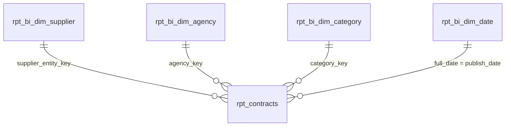

# Power BI consumption layer

This folder is the **Power BI semantic model as code**: the connection queries
(`queries.m`), the measures (`measures.dax`), and the modeling decisions below.
Assemble them in Power BI Desktop to produce the report.

A binary `.pbix` is deliberately **not** committed: it is opaque to version
control, and it would embed the Snowflake account host. Model-as-code (M + DAX +
the relationships spec here) is the reviewable, diff-able form — and it rebuilds in
Desktop in a few minutes.

## What it connects to

Power BI reads the **MART** layer only, through the least-privilege `austender_analyst`
role on the `austender_bi_wh` warehouse — never the raw GOLD star. The mart exposes
a clean star for exactly this purpose (`snowflake` RBAC keeps GOLD ungranted; the
mart views reach it through ownership chaining):

- **Fact** — `rpt_contracts`: one row per contract, with the data-quality caveats
  already surfaced as columns (`is_attributable`, `is_active`, `abn_source`) so
  measures can respect them.
- **Dimensions** — `rpt_bi_dim_supplier`, `rpt_bi_dim_agency`, `rpt_bi_dim_category`,
  `rpt_bi_dim_date`.

## The star (relationships)

All relationships are single-direction (dimension filters fact), single cardinality.
Mark `rpt_bi_dim_date` as the model's **Date table** (on `full_date`) so time
intelligence works. Hide the raw key columns and the redundant name columns that
`rpt_contracts` still carries, so report authors pick attributes from the dimensions.

## Storage mode: Import (and when it would be DirectQuery)

**Use Import here.** Concretely, for this dataset:

- The fact is ~238k rows of **static, historical** data (1999–2011) — it fits
  VertiPaq comfortably and never needs intraday freshness.
- Import gives the fastest visuals and full DAX/time-intelligence, and spends **no
  Snowflake compute per interaction** — it matters on a trial account with a
  50-credit monitor.

**Choose DirectQuery instead when** the fact is too large to import, near-real-time
freshness is required, row-level security must be enforced in Snowflake, or
governance forbids copying data out. None of those hold here, so Import wins. If the
fact later grew, the scaling path is **Import with incremental refresh** partitioned
on `publish_date` (or a Dual-mode dimension set) rather than a blanket switch to
DirectQuery.

## Rebuild steps

1. Power BI Desktop → **Get Data → Snowflake**. Server `<account>.snowflakecomputing.com`,
   warehouse `AUSTENDER_BI_WH`; sign in as a user with the `austender_analyst` role.
   (Or paste the queries from `queries.m` into the Advanced Editor.)
2. Load `rpt_contracts` and the four `rpt_bi_dim_*` tables.
3. Create the four relationships shown above; mark `rpt_bi_dim_date` as the Date table.
4. Add the measures from `measures.dax` (New measure → paste).
5. Build visuals: spend by agency/category, attributable-vs-total, active contracts,
   spend over time.

The account host is intentionally a placeholder — the real identifier lives only in
the gitignored `ingestion/.env`, never in the repo.
